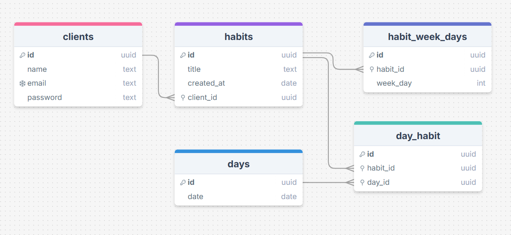

# My Habbits

## Project setup

To install all the dependencies required to run the application for both development and production dependencies.

```bash
$ pnpm install
```

## Using Docker and Docker compose

This project is using docker with docker compose to run the database services (Postgresql) of the project under development.

To run it on your machine you will need to download docker desktop and docker itself.

```bash
$ pnpm docker compose up -d
```

By running this command I am launching all the external services needed for my application in an isolated and local way. So far there is only the database service with Postgresql SGBD.

## Migrations with Prisma

When we change the Postgres service for the first time, it is necessary to get the existing migrations, because the database does not currently recognize which tables or models this database has. To do this, we have to run the migrations deployment.

```bash
$ pnpm prisma migrate deploy
```

## Analyzing environment variables

You can see all the environment variables for your application in the .env.example file. Make this file .env and add the variables needed to run your application. Remember, environment variables are validated and required by your application.

```bash
# Database 

DATABASE_URL=
DATABASE_USER=
DATABASE_PASSWORD=
DATABASE_NAME=

# Json Web Token

JWT_PRIVATE_KEY=
JWT_PUBLIC_KEY=

# System

PORT=

```
Database information is important for Prisma and Docker. The JSON web token part is very important for user authentication and the JWT strategy. A very important point is the need to generate these private and public keys and then transform them into base64 format.

```bash
# Generate private key
$ openssl genpkey -algorithm RSA -out private_key.pem -pkeyopt rsa_keygen_bits:2048

# Generate public key based in a private key
$ openssl rsa -pubout -in private_key.pem -out public_key.pem

# Transformation private key in base64 format
$ openssl base64 -in private_key.pem -out private_key_base64.txt

# Transformation public key in base64 format
$ openssl base64 -in public_key.pem -out public_key_base64.txt

```


## Compile and run the project

```bash
# development
$ pnpm run start

# watch mode
$ pnpm run start:dev

# production mode
$ pnpm run start:prod
```

## Run tests

```bash
# unit tests
$ pnpm run test

# e2e tests
$ pnpm run test:e2e

# test coverage
$ pnpm run test:cov
```

## Access docs page

In this project we are using Swagger to document our routes so that it is easy for anyone to understand them in front-end development. Therefore, when running the project in development mode, access the Swagger documentation via the route <a href="http://localhost:3333/docs" style="color: #189ab4;">http://localhost:3333/docs</a> 

OBS: In this project, the port is 3333, but you can change to your port value

## Database



## 🛠 Tech and Libraries

<div style="display: inline_block"><br>
  
  
  
  
  
  
  
</div>

